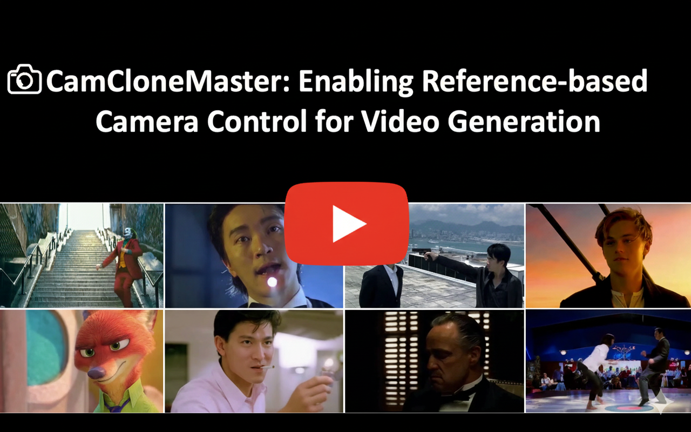

<p align="center" >
    
</p>

# <div align="center" >Enabling Reference-based Camera Control for Video Generation<div align="center">

###  <div align="center"> SIGGRAPH Asia 2025 </div>
<div align="center">
  <a href="https://luo0207.github.io/yawenluo/">Yawen Luo</a>, 
  <a href="https://jianhongbai.github.io/">Jianhong Bai</a>, 
  <a href="https://xiaoyushi97.github.io/">Xiaoyu Shi</a><sup>†</sup>, 
  <a href="https://menghanxia.github.io/">Menghan Xia</a>, 
  <a href="https://xinntao.github.io/">Xintao Wang</a>, 
  <a href="https://magicwpf.github.io/">Pengfei Wan</a>, 
  <a href="https://openreview.net/profile?id=~Di_ZHANG3">Di Zhang</a>,
  <a href="https://openreview.net/profile?id=~Kun_Gai1">Kun Gai</a>,
  <a href="https://tianfan.info/">Tianfan Xue</a><sup>†</sup>
</div>

<br>

<p align="center">
  <a href='https://camclonemaster.github.io/'></a>
  &nbsp;
  <a href='https://youtu.be/Os18zynOqM4'></a>
  &nbsp;
  <a href="https://arxiv.org/abs/2506.03140"></a>
  &nbsp;
  <a href='https://huggingface.co/datasets/KwaiVGI/CameraClone-Dataset'></a>
</p>

**Note:** This open-source repository is intended to provide a reference implementation. Due to the difference in the underlying I2V model's performance, the open-source version may not achieve the same performance as the model in our paper. 

## 🔥 Updates
- __[2025.09.25]__: [CamCloneMaster](https://arxiv.org/abs/2506.03140) has been accepted by SIGGRAPH Aisa 2025.
- __[2025.09.08]__: [CameraClone Dataset](https://huggingface.co/datasets/KwaiVGI/CameraClone-Dataset/) is avaliable.
- __[2025.06.03]__: Release the [Project Page](https://camclonemaster.github.io/) and the [Arxiv](https://arxiv.org/abs/2506.03140) version.

## 📷 Introduction
**TL;DR:** We propose CamCloneMaster, a framework that enables users to replicate camera movements from reference videos without requiring camera parameters or test-time fine-tuning. CamCloneMaster seamlessly supports reference-based camera control for both I2V and V2V tasks within a unified framework. We also release our [CameraClone Dataset](https://huggingface.co/datasets/KwaiVGI/CameraClone-Dataset) rendered with Unreal Engine 5.

<div align="center">

[](https://www.youtube.com/watch?v=Os18zynOqM4)

</div>

## ⚙️ Code: CamCloneMaster + Wan2.1 (Inference & Training)

The model utilized in our paper is an internally developed T2V model, not [Wan2.1](https://github.com/Wan-Video/Wan2.1). Due to company policy restrictions, we are unable to open-source the model used in the paper. 

Due to training cost limitations, we adapted the [Wan2.1-T2V-1.3B](https://huggingface.co/Wan-AI/Wan2.1-T2V-1.3B) model for Image-to-Video (I2V) generation. This was achieved by conditioning the first frame through channel concatenation, a method proposed in the [Wan technical report](https://arxiv.org/abs/2503.20314), rather than using the larger [Wan2.1-I2V-14B](https://huggingface.co/Wan-AI/Wan2.1-T2V-14B) model. We then integrated CamCloneMaster with this adapted 1.3B model to validate our method's effectiveness. Please note that results may differ from the demo due to this difference in the underlying I2V model.

### Inference

####  Step 1: Set up the environment

[DiffSynth-Studio](https://github.com/modelscope/DiffSynth-Studio) requires Rust and Cargo to compile extensions. You can install them using the following command:

```bash
curl --proto '=https' --tlsv1.2 -sSf [https://sh.rustup.rs](https://sh.rustup.rs/) | sh
. "$HOME/.cargo/env"
```

Install [DiffSynth-Studio](https://github.com/modelscope/DiffSynth-Studio):
```bash
git clone https://github.com/KwaiVGI/CamCloneMaster
cd CamCloneMaster
pip install -e .
```

####  Step 2: Download the pretrained checkpoints
1. Download the pre-trained Wan2.1-T2V-1.3B models
```bash
cd CamCloneMaster
python download_wan2.1.py
```

2. Download the adapted Wan2.1-I2V-1.3B and CamCloneMaster models

Please download checkpoints from [huggingface](https://huggingface.co/KwaiVGI/CamCloneMaster-Wan2.1) and place it in models/.

```bash
# Make sure git-lfs is installed (https://git-lfs.com)
git lfs install
git clone https://huggingface.co/KwaiVGI/CamCloneMaster-Wan2.1
```

#### Step 3: Test Adapted Wan-1.3B-I2V & CamCloneMaster on example videos

1. Test Image-to-Video Generation with Adapted Wan-1.3B-I2V Checkpoints

```python
python inference_i2v.py --dataset_path demo/example_csv/infer/example_i2v_testset.csv --ckpt_path models/CamCloneMaster-Wan2.1/Wan-I2V-1.3B-Step8000.ckpt --output_dir demo/i2v_output
```

2. Test Camera Controlled Image-to-Video Generation with CamCloneMaster Checkpoints
```python
python inference_camclone.py --cameraclone_type i2v --dataset_path demo/example_csv/infer/example_camclone_testset.csv --ckpt_path models/CamCloneMaster-Wan2.1/CamCloneMaster-Step9500.ckpt --output_dir demo/camclone_i2v_output
```
3. Test Camera Controlled Video-to-Video Re-Generation with CamCloneMaster Checkpoints
```python
python inference_camclone.py --cameraclone_type v2v --dataset_path demo/example_csv/infer/example_camclone_testset.csv --ckpt_path models/CamCloneMaster-Wan2.1/CamCloneMaster-Step9500.ckpt --output_dir demo/camclone_v2v_output
```

### Training

#### Step 1: Set up the environment
```python
pip install lightning pandas websockets
```

#### Step 2: Prepare the training dataset
Download the [CameraClone Dataset](https://huggingface.co/datasets/KwaiVGI/CameraClone-Dataset).

```bash
sudo apt-get install git-lfs
git lfs install
git clone https://huggingface.co/datasets/KwaiVGI/CameraClone-Dataset
cat CamCloneDataset.part* > CamCloneDataset.tar.gz
tar -xzvf CamCloneDataset.tar.gz
```

#### Step 3: Training CamCloneMaster 
```python
CUDA_VISIBLE_DEVICES="0,1,2,3,4,5,6,7" python train_camclone.py --dataset_path CameraClone-Dataset/CamCloneDataset.csv/ --output_path models/train
```
## 📷 Dataset: Camera Clone Dataset

#### 1. Dataset Introduction

**TL;DR:** The Camera Clone Dataset, introduced in [CamCloneMaster](https://arxiv.org/pdf/2506.03140), is a large-scale synthetic dataset designed for camera clone learning, encompassing diverse scenes, subjects, and camera movements. It consists of triple video sets: a camera motion reference video $V_{cam}$, a content reference video $V_{cont}$, and a target video $V$, which recaptures the scene in $V_{cont}$ with the same camera movement as $V_{cam}$.

<div align="center">
  <video controls autoplay style="width: 100%;" src="Figs/dataset.mp4"></video>
</div>

The Camera Clone Dataset is rendered using Unreal Engine 5. We collect 40 3D scenes as backgrounds, and we also collect 66 characters and put them into the 3D scenes as main subjects, each character is combined with one random animation, such as running and dancing.

To construct the triple set, camera trajectories must satisfy two key requirements: 1) **Simultaneous Multi-View Capture**: Multiple cameras must film the same scene concurrently, each following a distinct trajectory. 2) **Paired Trajectories**: paired shots with the same camera trajectories across different locations. Our implementation strategy addresses these needs as follows: Within any single location, 10 synchronized cameras operate simultaneously, each following one of ten unique, pre-defined trajectories to capture diverse views. To create paired trajectories, we group 3D locations in scenes into sets of four, ensuring that the same ten camera trajectories are replicated across all locations within each set. The camera trajectories themselves are automatically generated using designed rules. These rules encompass various types, including basic movements, circular arcs, and more complex camera paths.

In total, Camera Clone Dataset comprises 391K visually authentic videos shooting from 39.1K different locations in 40 scenes with 97.75K diverse camera trajectories, and 1,155K triple video sets are constructed based on these videos. Each video has a resolution of 576 x 1,008 and 77 frames.

**3D Environment:** We collect 40 high-quality 3D environments assets from [Fab](https://www.fab.com). To minimize the domain gap between rendered data and real-world videos, we primarily select visually realistic 3D scenes, while choosing a few stylized or surreal 3D scenes as a supplement. To ensure data diversity, the selected scenes cover a variety of indoor and outdoor settings, such as city streets, shopping malls, cafes, office rooms, and the countryside.

**Character:** We collect 66 different human 3D models as characters from [Fab](https://www.fab.com) and [Mixamo](https://www.mixamo.com).

**Animation:** We collect 93 different animations from [Fab](https://www.fab.com) and [Mixamo](https://www.mixamo.com), including common actions such as waving, dancing, and cheering. We use these animations to drive the collected characters and create diverse datasets through various combinations.

**Camera Trajectories:** To prevent clipping, trajectories are constrained by a maximum movement distance $d_{max}$, determined by the initial shot position in the scene. The types of trajectories contain:
  * **Basic**: Simple pans/tilts (5°-75°), rolls (20°-340°), and translations along cardinal axes.
  * **Arc**: Orbital paths, combining a primary rotation (10°-75°) with smaller, secondary rotations (5°-15°).
  * **Random**: Smooth splines interpolated between 2-4 random keypoints. Half of these splines also incorporated with multi-axis rotations.

#### 2. Statistics and Configurations

Dataset Statistics:
| Number of Dynamic Scenes | Camera per Scene | Total Videos | Number of Triple Sets |
|:------------------------:|:----------------:|:------------:|:------------:|
| 39,100                   | 10               | 391,000      |1154,819      |

Video Configurations:

| Resolution  | Frame Number | FPS                      |
|:-----------:|:------------:|:------------------------:|
| 1344x768   | 77           | 15                       |
| 1008x576   | 77           | 15                       |

Note: You can use 'center crop' to adjust the video's aspect ratio to fit your video generation model, such as 16:9, 9:16, 4:3, or 3:4.


#### 3. File Structure
```
Camera-Clone-Dataset
├──data
    ├── 0316
    │   └── traj_1_01
    │       ├── scene1_01.mp4
    │       ├── scene550_01.mp4
    │       ├── scene935_01.mp4
    │       └── scene1224_01.mp4
    ├── 0317
    ├── 0401
    ├── 0402
    ├── 0404
    ├── 0407
    └── 0410
```

#### 4. Use Dataset
```bash
sudo apt-get install git-lfs
git lfs install
git clone https://huggingface.co/datasets/KwaiVGI/CameraClone-Dataset
cat CamCloneDataset.part* > CamCloneDataset.tar.gz
tar -xzvf CamCloneDataset.tar.gz
```

The "Triple Sets" information is located in the [CamCloneDataset.csv](https://huggingface.co/datasets/KwaiVGI/CameraClone-Dataset/blob/main/CamCloneDataset.csv) file, which contains the following columns:
* video_path: The path to the target video.
* caption: A description of the target video.
* ref_video_path: The path to the camera reference video.
* content_video_path: The path to the content reference video.

## 🌟 Citation
Please leave us a star 🌟 and cite our paper if you find our work helpful.
```txt
@misc{luo2025camclonemaster,
      title={CamCloneMaster: Enabling Reference-based Camera Control for Video Generation}, 
      author={Yawen Luo and Jianhong Bai and Xiaoyu Shi and Menghan Xia and Xintao Wang and Pengfei Wan and Di Zhang and Kun Gai and Tianfan Xue},
      year={2025},
      eprint={2506.03140},
      archivePrefix={arXiv},
      primaryClass={cs.CV},
      url={https://arxiv.org/abs/2506.03140}, 
}
```